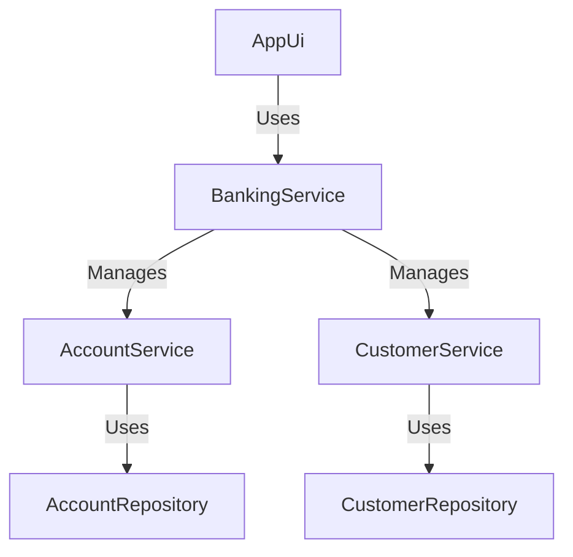

<div align="center">

# 🏦 LordBank

[](https://www.oracle.com/java/)
[](LICENSE)
[](https://github.com/porfskylord/LordBank/)

A robust banking application built with Java 17+ that provides essential banking operations with a clean, object-oriented design.

</div>

## ✨ Features

### 🏛️ Account Management
- **Account Types**
  - 💰 **Savings Account**: Earn interest on your balance
  - 💳 **Current Account**: With overdraft facility

- **Account Operations**
  - 🆕 Open new accounts
  - 🚪 Close accounts
  - 📊 View account details
  - 🔍 List all accounts
  - 📈 Apply monthly interest

### 👥 Customer Management
- 👤 Customer registration
- 📝 Update customer information
- 🔍 View customer details
- 📋 List all customers

### 💸 Transaction System
- 💰 Deposits
- 💳 Withdrawals
- 🔄 Fund Transfers

### 📈 Interest & Charges
- 🏦 Savings account interest calculation
- ⚠️ Overdraft interest for current accounts

### 🔒 Security & Data Persistence
- 🔐 Simple authentication
- 📝 Basic audit logging
- 💾 **Automatic Data Persistence**
  - All data is automatically saved to disk
  - Data persists between application restarts
  - Stored in the `data` directory
  - Automatic backup of customer and account information

### 🖥️ User Interface
- Console-based interface
- Intuitive menu system

## 💾 Data Storage

All application data is automatically saved to the `data` directory in the application's root folder. The following files are created and managed:

- `customers.dat` - Stores all customer information
- `accounts.dat` - Stores all account details
- `transactions.dat` - Records all transactions

### Data Backup
- The application automatically creates backups of your data
- Data is saved after each modification
- No manual saving required

## 🚀 Getting Started

### Prerequisites

- Java Development Kit (JDK) 17 or higher
- Git (for version control, optional)

### Installation

1. **Clone the repository** (or download the source code):
   ```bash
   git clone https://github.com/porfskylord/LordBank.git
   cd LordBank
   ```

2. **Compile the application**:
   ```bash
   javac -d bin -sourcepath src src/Main.java
   ```

3. **Run the application**:
   ```bash
   java -cp bin Main
   ```
   
   Or use the provided `run.bat` script on Windows:
   ```
   run.bat
   ```

### Default Login Credentials
- **Username**: admin
- **Password**: admin

## 🏗️ System Architecture

### High-Level Design



### Core Components

#### 1. Entity Layer
- `Account` (Abstract Base)
  - `SavingsAccount`
  - `CurrentAccount`
- `Customer`
- `Transaction`
- `AuditLog`
- Enums (`AccountType`, `TransactionType`, `Gender`)

#### 2. Repository Layer
- `AccountRepository` - Manages account data
- `CustomerRepository` - Handles customer data

#### 3. Service Layer
- `BankingService` - Main service orchestrator
- `AccountService` - Account operations
- `CustomerService` - Customer management

#### 4. UI Layer
- `AppUi` - Console-based user interface

## 📚 Documentation

### Account Types

#### Savings Account
- **Minimum Balance**: ₹1,000.00
- **Interest Rate**: 2.5% per annum
- **Features**:
  - Interest calculation on balance
  - Monthly interest credit
  - Basic transaction capabilities

#### Current Account
- **Minimum Balance**: ₹5,000.00
- **Overdraft Facility**: Available
- **Features**:
  - Overdraft capability
  - Standard transaction support

### Transaction Types

| Type | Description |
|------|-------------|
| DEPOSIT | Cash deposit |
| WITHDRAWAL | Cash withdrawal |
| TRANSFER | Inter-account transfer |
| INTEREST | Interest credit |
| FEE | Service charges |

## 🛠️ Project Structure

```
src/
├── app_ui/          # User interface components
├── auth/            # Authentication
├── entity/          # Domain models
│   └── enums/       # Enumerations
├── interfaces/      # Interfaces
└── util/            # Utility classes
```

### Building the Project

1. **Compile the application**:
   ```bash
   javac -d bin -sourcepath src src/Main.java
   ```

2. **Create executable JAR**:
   ```bash
   jar cvfm LordBank.jar MANIFEST.MF -C bin .
   ```

3. **Run the JAR file**:
   ```bash
   java -jar LordBank.jar
   ```

## 📝 License

This project is licensed under the MIT License - see the [LICENSE](LICENSE) file for details.

## 🙏 Acknowledgments

- Built with ❤️ for educational purposes
- Inspired by real-world banking systems
```

## 📊 Screenshots

*(Screenshots will be added in the future)*

## 🤝 Contributing

Contributions are welcome! Please follow these steps:

1. Fork the repository
2. Create your feature branch (`git checkout -b feature/AmazingFeature`)
3. Commit your changes (`git commit -m 'Add some AmazingFeature'`)
4. Push to the branch (`git push origin feature/AmazingFeature`)
5. Open a Pull Request

Please ensure your code follows the existing style and includes appropriate documentation.

---

<div align="center">
  Made with ❤️ by Azad
</div>

## Features

### 1. Account Management
- **Account Types**:
  - Savings Account
  - Current Account (with overdraft facility)
- **Account Operations**:
  - Open new accounts
  - Close accounts
  - View account details
  - Check balance
  - View transaction history

### 2. Customer Management
- Register new customers
- Update customer information
- View customer details
- Search customers by name

### 3. Transactions
- Deposit money
- Withdraw money
- Transfer funds between accounts
- View transaction history
- Generate transaction statements

### 4. Interest Calculation
- Automatic interest calculation for savings accounts
- Overdraft interest for current accounts
- Manual interest application

### 5. Security
- Input validation
- Transaction logging
- Audit trail

## Architecture

### Core Components

#### 1. Entity Layer
- `Account` (Abstract base class)
  - `SavingsAccount`
  - `CurrentAccount`
- `Customer`
- `Transaction`
- `AuditLog`
- Enums (`AccountType`, `TransactionType`, `Gender`)

#### 2. Repository Layer
- `AccountRepository` - Manages account data
- `CustomerRepository` - Manages customer data

#### 3. Service Layer
- `AccountService` - Handles business logic for accounts
- `CustomerService` - Handles business logic for customers
- `BankingService` - High-level banking operations

#### 4. UI Layer
- `AppUi` - Console-based user interface

## Getting Started

### Prerequisites
- Java 17 or higher
- Maven (for dependency management)

### Installation
1. Clone the repository
   ```bash
   git clone [repository-url]
   cd LordBank
   ```

2. Build the project
   ```bash
   mvn clean install
   ```

3. Run the application
   ```bash
   mvn exec:java -Dexec.mainClass="app_ui.AppUi"
   ```

## Usage

### 1. Customer Management
- **Register a new customer**:
  - Name, age, gender, address, email, and phone number are required
  - System generates a unique customer ID

- **Update customer details**:
  - Update name, email, phone number, or address
  - Customer ID cannot be changed

### 2. Account Operations
- **Open a new account**:
  - Select account type (Savings/Current)
  - Provide initial deposit (minimum balance required)
  - System generates account number

- **Close an account**:
  - Account balance must be zero
  - All transactions are preserved

### 3. Transactions
- **Deposit**:
  - Enter account number and amount
  - Transaction is recorded with timestamp

- **Withdrawal**:
  - Check for sufficient balance
  - Current accounts can use overdraft facility

- **Transfer**:
  - Transfer between any two accounts
  - Both accounts must be active

## Business Rules

### Account Rules
- **Savings Account**:
  - Minimum balance: $1,000
  - Earns interest on positive balance

- **Current Account**:
  - Minimum balance: $5,000
  - Overdraft facility available
  - Interest charged on negative balance

### Transaction Rules
- All transactions are logged
- Transaction history is maintained
- Audit trail for all operations

## Error Handling
- Invalid input validation
- Insufficient funds check
- Account status verification
- Customer verification

## Future Enhancements
1. Add web-based UI
2. Implement JWT authentication
3. Add reporting module
4. Support for multiple currencies
5. Email notifications

## Contributing
Contributions are welcome! Please follow the standard fork and pull request workflow.


