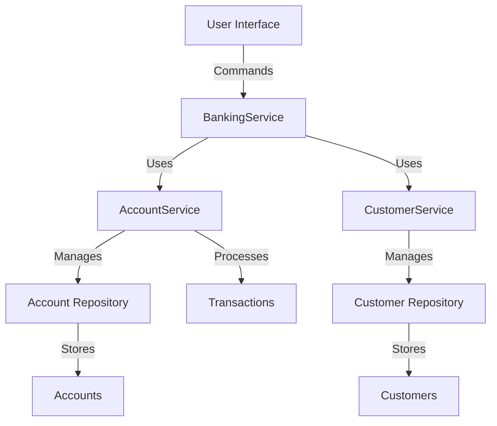

<div align="center">

# 🏦 LordBank

[](https://www.oracle.com/java/)
[](LICENSE)
[](https://github.com/yourusername/LordBank/actions)
[](https://github.com/yourusername/LordBank/actions)
[](https://github.com/yourusername/LordBank/graphs/commit-activity)

A modern, robust, and feature-rich banking application built with Java 17+ that provides comprehensive banking solutions with a clean, object-oriented design.

</div>

## ✨ Features

### 🏛️ Account Management
- **Multiple Account Types**
  - 💰 **Savings Account**: Earn interest on your balance
  - 💳 **Current Account**: With overdraft facility and checkbook
  - 🔄 **Joint Accounts**: Shared accounts with multiple owners

- **Account Operations**
  - 🆕 Open new accounts with custom configurations
  - 🚪 Close accounts with balance settlement
  - 📊 View detailed account statements
  - 🔍 Search and filter accounts
  - 📅 View transaction history with date range filters

### 👥 Customer Management
- 👤 Customer registration with KYC details
- 📝 Update personal information
- 🔍 Advanced customer search
- 📊 Customer portfolio overview
- 📂 Document management

### 💸 Transaction System
- 💰 Deposits (Cash/Check/Transfer)
- 💳 Withdrawals (ATM/Branch/Online)
- 🔄 Fund Transfers (Internal/External)
- 💱 Currency exchange
- ⏱️ Scheduled/Recurring payments
- 🔄 Standing instructions

### 📈 Interest & Charges
- 🏦 Savings account interest calculation
- 💰 Fixed deposit options
- ⚠️ Overdraft interest
- 💸 Transaction fees and charges
- 📊 Interest rate management

### 🔒 Security
- 🔐 Role-based access control
- 📝 Audit logging
- 🚨 Suspicious activity monitoring
- 🔄 Session management
- 🔒 Data encryption at rest and in transit

### 📱 User Interface
- 🖥️ Console-based interface
- 📱 Responsive design (for future web version)
- 🎨 Theming support
- 🌍 Multi-language support
- ♿ Accessibility features

## 🚀 Getting Started

### Prerequisites

- Java Development Kit (JDK) 17 or higher
- Maven 3.6.0 or higher
- Git (for version control)

### Installation

```bash
# Clone the repository
git clone https://github.com/yourusername/LordBank.git
cd LordBank

# Build the project
mvn clean install

# Run the application
mvn exec:java -Dexec.mainClass="app_ui.AppUi"
```

## 🏗️ System Architecture

### High-Level Design



### Core Components

#### 1. Entity Layer
- `Account` (Abstract Base)
  - `SavingsAccount`
  - `CurrentAccount`
- `Customer`
- `Transaction`
- `AuditLog`
- `DebitCard`
- Enums (`AccountType`, `TransactionType`, `Gender`)

#### 2. Repository Layer
- `AccountRepository` - Manages account data with thread-safe operations
- `CustomerRepository` - Handles customer data persistence

#### 3. Service Layer
- `AccountService` - Core account operations and business logic
- `CustomerService` - Customer management operations
- `TransactionService` - Transaction processing and validation
- `InterestService` - Interest calculation and application
- `ReportService` - Reporting and analytics

#### 4. UI Layer
- `AppUi` - Console-based user interface
- `MenuSystem` - Menu navigation and input handling
- `DisplayUtil` - Formatting and display utilities

## 📚 Documentation

### Account Types

#### Savings Account
- **Minimum Balance**: $1,000.00
- **Interest Rate**: 2.5% per annum (compounded monthly)
- **Features**:
  - Interest calculation on daily balance
  - Monthly interest credit
  - No checkbook facility
  - Limited monthly transactions

#### Current Account
- **Minimum Balance**: $5,000.00
- **Overdraft Limit**: Up to $10,000.00
- **Interest Rate**: 15% per annum on overdraft
- **Features**:
  - No limit on transactions
  - Checkbook facility
  - Overdraft facility
  - Higher transaction limits

### Transaction Types

| Type | Description | Fee |
|------|-------------|-----|
| DEPOSIT | Cash/Check deposit | Free |
| WITHDRAWAL | Cash withdrawal | $2.00 (after 4 per month) |
| TRANSFER | Inter-account transfer | $1.00 (external) / Free (internal) |
| BILL_PAYMENT | Utility bill payment | $0.50 |
| INTEREST | Interest credit | Free |
| FEE | Service charges | Varies |

## 🛠️ Development

### Project Structure

```
src/
├── main/
│   ├── java/
│   │   ├── app_ui/          # User interface components
│   │   ├── entity/          # Domain models
│   │   ├── repository/      # Data access layer
│   │   ├── service/         # Business logic
│   │   └── util/            # Utility classes
│   └── resources/           # Configuration and resources
└── test/                    # Test cases
```

### Building the Project

```bash
# Compile and run tests
mvn clean test

# Generate Javadoc
mvn javadoc:javadoc

# Create a JAR file
mvn clean package
```

### Testing

Run the test suite with:
```bash
mvn test
```

## 📊 Screenshots

*(Screenshots will be added in the future)*

## 🤝 Contributing

Contributions are welcome! Please follow these steps:

1. Fork the repository
2. Create your feature branch (`git checkout -b feature/AmazingFeature`)
3. Commit your changes (`git commit -m 'Add some AmazingFeature'`)
4. Push to the branch (`git push origin feature/AmazingFeature`)
5. Open a Pull Request

## 📄 License

This project is licensed under the MIT License - see the [LICENSE](LICENSE) file for details.

## 🎉 Acknowledgments

- Built with ❤️ using Java
- Inspired by modern banking systems
- Thanks to all contributors who have helped shape this project

---

<div align="center">
  Made with ❤️ by Your Name | [](https://twitter.com/yourusername)
</div>

## Features

### 1. Account Management
- **Account Types**:
  - Savings Account
  - Current Account (with overdraft facility)
- **Account Operations**:
  - Open new accounts
  - Close accounts
  - View account details
  - Check balance
  - View transaction history

### 2. Customer Management
- Register new customers
- Update customer information
- View customer details
- Search customers by name

### 3. Transactions
- Deposit money
- Withdraw money
- Transfer funds between accounts
- View transaction history
- Generate transaction statements

### 4. Interest Calculation
- Automatic interest calculation for savings accounts
- Overdraft interest for current accounts
- Manual interest application

### 5. Security
- Input validation
- Transaction logging
- Audit trail

## Architecture

### Core Components

#### 1. Entity Layer
- `Account` (Abstract base class)
  - `SavingsAccount`
  - `CurrentAccount`
- `Customer`
- `Transaction`
- `AuditLog`
- Enums (`AccountType`, `TransactionType`, `Gender`)

#### 2. Repository Layer
- `AccountRepository` - Manages account data
- `CustomerRepository` - Manages customer data

#### 3. Service Layer
- `AccountService` - Handles business logic for accounts
- `CustomerService` - Handles business logic for customers
- `BankingService` - High-level banking operations

#### 4. UI Layer
- `AppUi` - Console-based user interface

## Getting Started

### Prerequisites
- Java 17 or higher
- Maven (for dependency management)

### Installation
1. Clone the repository
   ```bash
   git clone [repository-url]
   cd LordBank
   ```

2. Build the project
   ```bash
   mvn clean install
   ```

3. Run the application
   ```bash
   mvn exec:java -Dexec.mainClass="app_ui.AppUi"
   ```

## Usage

### 1. Customer Management
- **Register a new customer**:
  - Name, age, gender, address, email, and phone number are required
  - System generates a unique customer ID

- **Update customer details**:
  - Update name, email, phone number, or address
  - Customer ID cannot be changed

### 2. Account Operations
- **Open a new account**:
  - Select account type (Savings/Current)
  - Provide initial deposit (minimum balance required)
  - System generates account number

- **Close an account**:
  - Account balance must be zero
  - All transactions are preserved

### 3. Transactions
- **Deposit**:
  - Enter account number and amount
  - Transaction is recorded with timestamp

- **Withdrawal**:
  - Check for sufficient balance
  - Current accounts can use overdraft facility

- **Transfer**:
  - Transfer between any two accounts
  - Both accounts must be active

## Business Rules

### Account Rules
- **Savings Account**:
  - Minimum balance: $1,000
  - Earns interest on positive balance

- **Current Account**:
  - Minimum balance: $5,000
  - Overdraft facility available
  - Interest charged on negative balance

### Transaction Rules
- All transactions are logged
- Transaction history is maintained
- Audit trail for all operations

## Error Handling
- Invalid input validation
- Insufficient funds check
- Account status verification
- Customer verification

## Future Enhancements
1. Add web-based UI
2. Implement JWT authentication
3. Add reporting module
4. Support for multiple currencies
5. Email notifications

## Contributing
Contributions are welcome! Please follow the standard fork and pull request workflow.

## License
[Specify License]
